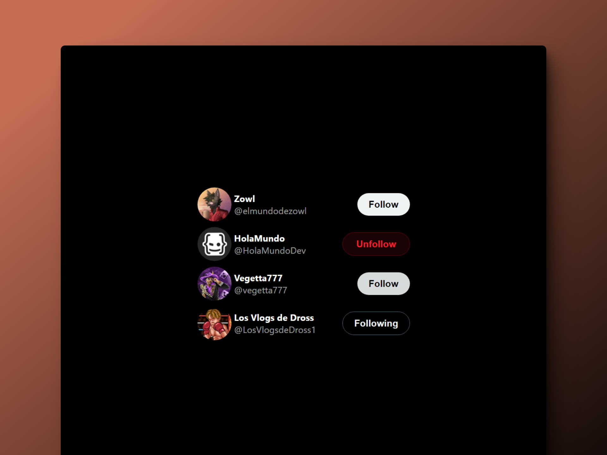

# 💌 React + Vite: X Follow Card

### Cards para seguir a usuarios

> 🧩 Aquí puedes ver su [**Live Demo.**](https://x-follow-card-abraham.netlify.app/)

## 🚀 Descripción

Este es un pequeño proyecto para iniciar en React desde cero.

Es una recreación de las follow cards en la antigua Twitter (actual X).

## 🎭 Tecnologías

El proyecto utiliza las siguientes tecnologías:

- Vite como empaquetador de aplicaciones.
- Componentes de React.
- El hook useState de React.
- Renderizado condicional.
- Template strings.
- [**styled-components**](https://styled-components.com/) para aplicar los estilos.
