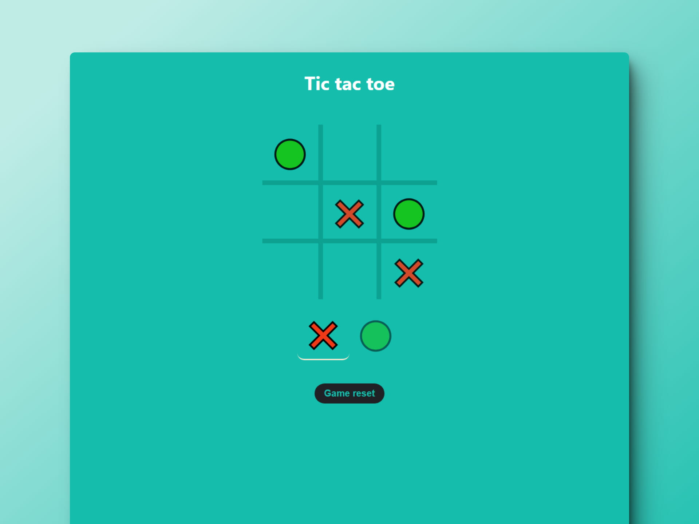

# 🎰 React + Vite: Tic Tac Toe

### Tres en raya

> 🧩 Aquí puedes ver su [**Live Demo.**](https://tic-tac-toe-abraham.netlify.app/)

## 🚀 Descripción

Este proyecto es una implementación del popular juego Tic Tac Toe (también conocido como Tres en Raya).

## 🎭 Tecnologías

El proyecto utiliza las siguientes tecnologías:

- Manejo de estado en React con el hook useState.
- Persistencia de datos con localStorage.
- Lógica reutilizable en JavaScript, para ser utilizada en otros frameworks.
- [**styled-components**](https://styled-components.com/) para aplicar los estilos.
