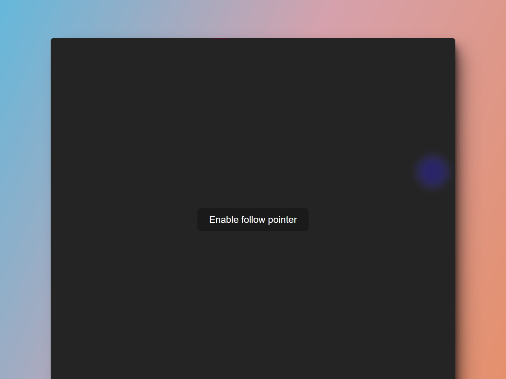

# 🖱 React + Vite: Mouse Follower

### Seguidor del mouse

> 🧩 Aquí puedes ver su [**Live Demo.**](https://mouse-follower-abraham.netlify.app/)

## 🚀 Descripción

Este es un pequeño proyecto para **emular el seguimiento de un mouse**.

## 🎭 Tecnologías

El proyecto utiliza las siguientes tecnologías:

- Los hooks de React, **useState** y **useEffect.**
- Estilos en línea.
- [**styled-components**](https://styled-components.com/) para aplicar los estilos.
