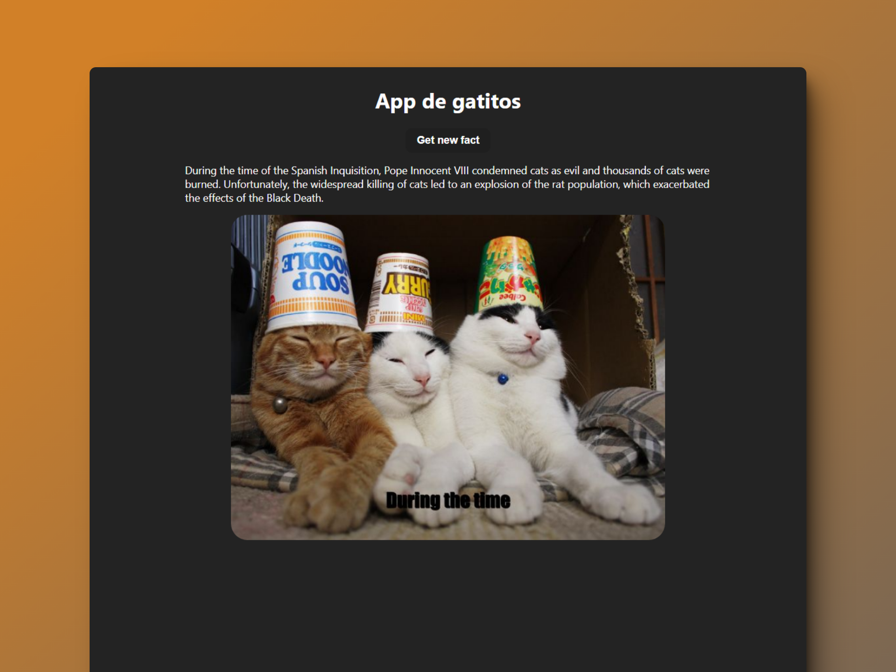

# 🧾 React + Vite: Technical Test

### Prueba técnica

> 🧩 Aquí puedes ver su [**Live Demo.**](https://prueba-tecnica-abraham.netlify.app/)

## 🚀 Descripción

Esta es una prueba técnica para **Juniors y Trainees** de React en Live Coding.

Tiene una serie de **requerimientos básicos**, los cuales son **cumplidos.**

## 🎭 Tecnologías

El proyecto utiliza las siguientes tecnologías:

- Custom Hooks en JavaScript para renderizar las imágenes y un hecho random.
- Test básicos con la librería [**Playwright**](https://playwright.dev/).
- [**styled-components**](https://styled-components.com/) para aplicar los estilos.

👇 Aquí abajo encontrarás la prueba

# Prueba técnica

**APIs:**

- Facts Random: https://catfact.ninja/fact
- Imagen random: https://cataas.com/cat/says/hello

**Requerimientos:**

- Recupera un hecho aleatorio de gatos de la primera API
- Recuperar la primera palabra del hecho
- Muestra una imagen de un gato con la primera palabra.
