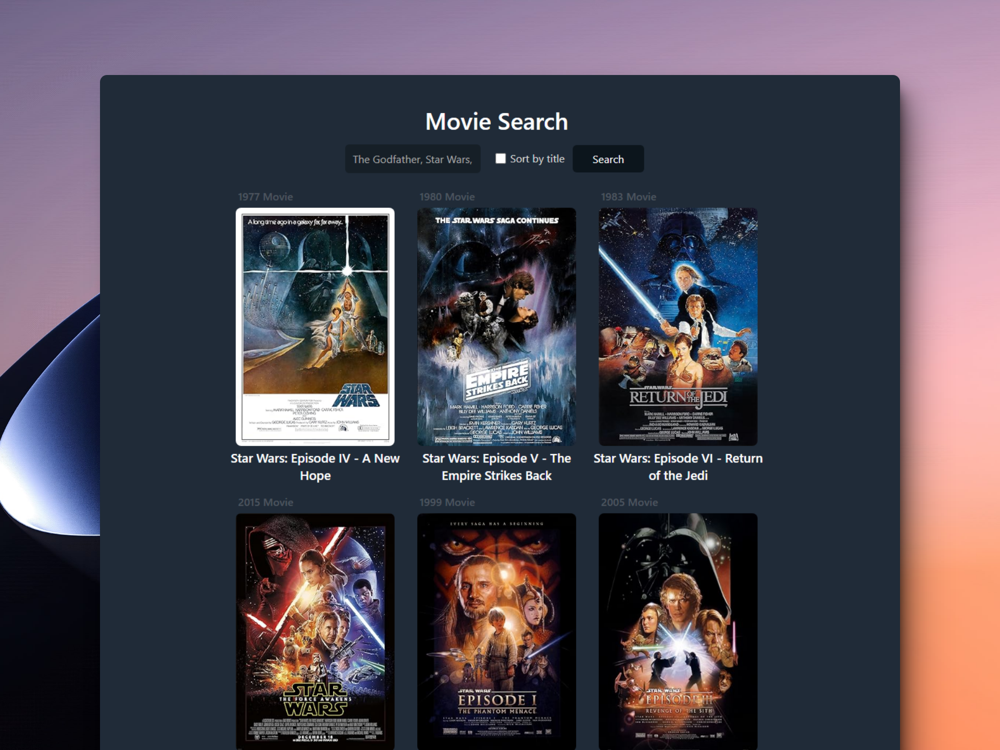

# 🍿 React + Vite: Movie Search

### Buscador de películas

> 🧩 Aquí puedes ver su [**Live Demo.**](https://movies-search-abraham.netlify.app/)

## 🚀 Descripción

Este es un proyecto basado en una prueba técnica que tiene una serie de requerimientos, los cuales son cumplidos.

## 🎭 Tecnologías

El proyecto utiliza las siguientes tecnologías:

- Custom hooks.
- Los hooks integrados de React **useRef**, **useMemo**, **useCallback**.
- Manejo de errores y campos obligatorios en **tiempo real.**
- La herramienta [**just-debounce-it**](https://github.com/angus-c/just#just-debounce-it) de angus-c para realizar el debounce.
- [**styled-components**](https://styled-components.com/) para aplicar los estilos.

## Enunciado

👇 Aquí debajo encontrarás la prueba técnica.

Crea una aplicación para buscar películas.

API a usar:

- https://www.omdbapi.com/
- API_KEY: Debes pedir una en la página

Requerimientos:

- Necesita mostrar un input para buscar la película y un botón para buscar.
- Lista las películas y muestra el título, año y poster.
- Que el formulario funcione
- Haz que las películas se muestren en un grid responsive.
- Hacer el fetching de datos a la API

Primera iteración:

- Evitar que se haga la misma búsqueda dos veces seguidas.
- Haz que la búsqueda se haga automáticamente al escribir.
- Evita que se haga la búsqueda continuamente al escribir (debounce)
