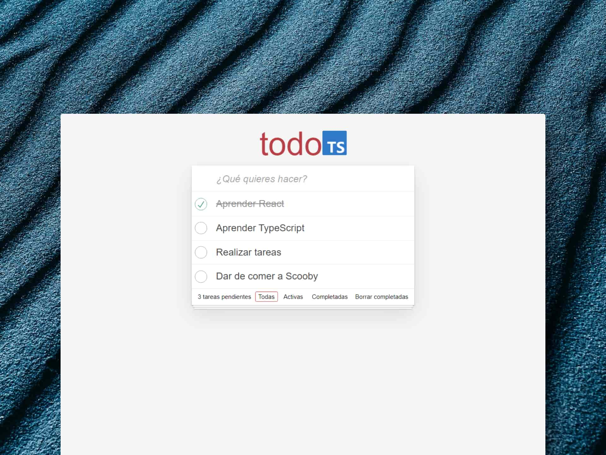

# 🖍 TypeScript and React: To-Do App

### Todo App con TypeScript y animaciones.

> 🧩 Aquí puedes ver su [**Live Demo**](https://todo-app-ts-abraham.netlify.app/).

## 🚀 Descripción

Este proyecto es una Lista de Tareas hecha con TypeScript y React.

Que además contiene animaciones.

## 🎭 Tecnologías

- [**todomvc-app-css**](https://github.com/tastejs/todomvc-app-css) para aplicar los estilos de la app.
- [**TypeScript**](https://www.typescriptlang.org/) para crear tipos reutilizables a través de la aplicación.

## 🧞‍♂️ Especifícaciones:

- [x] Inicializar proyecto con Vite
- [x] Añadir linter para TypeScript + React
- [x] Añadir estilos del TodoMVC
- [x] Listar todos los TODOs
- [x] Poder borrar un TODO
- [x] Marcar TODO como completado
- [x] Añadir forma de filtrar TODOs (Footer)
- [x] Mostrar número de TODOs pendientes (Footer)
- [x] Añadir forma de borrar todos los TODOs completados
- [x] Crear Header con input (Header)
- [x] Crear un TODO (Header)
- [ ] Poder editar el texto de un TODO (Doble click)
- [ ] Añadir animaciones con AutoAnimate
- [ ] Pasar a Reducer
- [ ] Sincronizar con el backend
