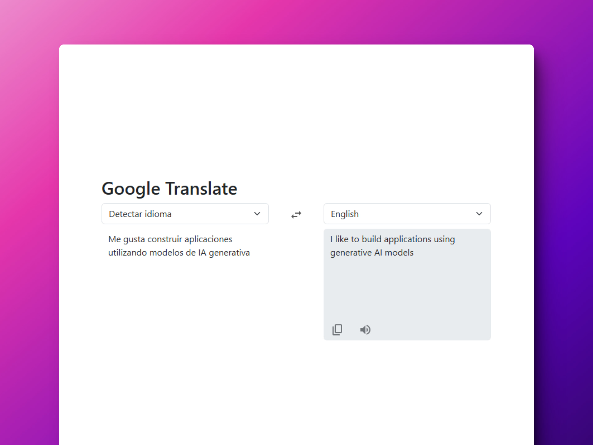
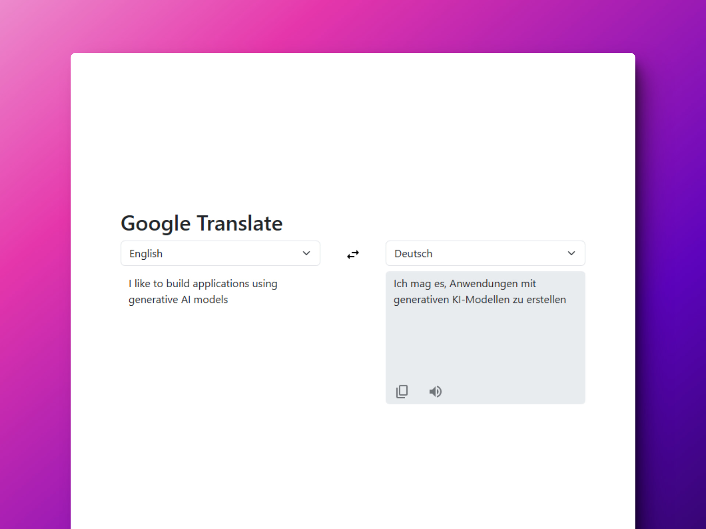

# 🌎 TypeScript + React: Google Translate Clone

### Clon del traductor web de Google

> 🧩 Aquí puedes ver su [**Live Demo**](https://google-translate-clone-abrahamgalue.netlify.app/).

## 🚀 Descripción

Este proyecto es un clon de Google Translate hecho con React y TypeScript.

Utiliza la [**API de Gemini**](https://ai.google.dev/) para las traducciones.

Te permite:

- **Traducir texto** de diferentes idiomas y cambiarlos
- **Copiar** la tradución al portapapeles
- **Escuchar** su pronuciación

## 🎭 Tecnologías

- [**google/generative-ai**](https://www.npmjs.com/package/@google/generative-ai) Google AI SDK utilizando un **modelo generativo** para las traducciones.
- [**React-Bootstrap**](https://react-bootstrap.netlify.app/) para los componentes reutilizables de **UI**.
- [**React Testing Library**](https://testing-library.com/docs/react-testing-library/intro), [**happy-dom**](https://www.npmjs.com/package/happy-dom) y [**Vitest**](https://vitest.dev/) para realizar **test unitarios**.
