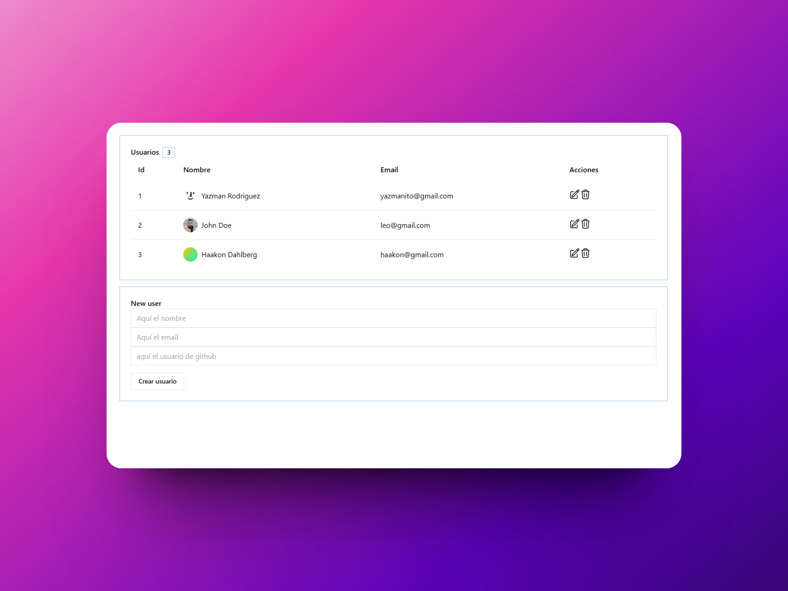
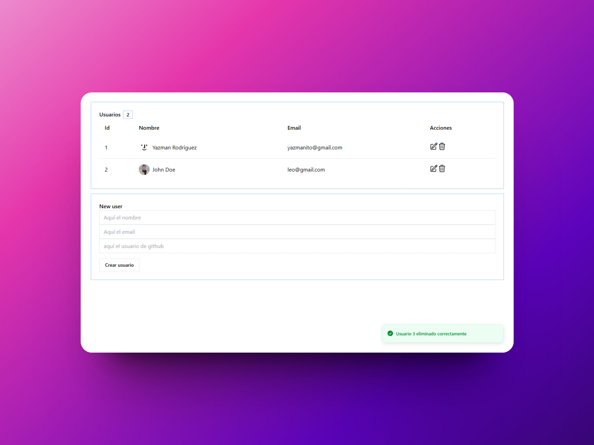

# ✉ React + Redux: CRUD

### Gestor de usuarios hecho con React y Redux

> 🧩 Aquí puedes ver su [**Live Demo**](https://crud-react-redux-abrahamgalue.netlify.app/).

## 🚀 Descripción

Este proyecto es un CRUD hecho con React y Redux.

Utiliza [**Middlewares**](https://redux.js.org/understanding/history-and-design/middleware) para actualizar de manera optimista la UI.

## 🎭 Tecnologías

- [**Redux Toolkit**](https://redux-toolkit.js.org/) para **manejar el estado** de la aplicación.
- [**tremor**](https://www.tremor.so/) para aplicar estilos con componentes reutilizables de **UI**.
- [**Sonner**](https://sonner.emilkowal.ski/) para mostrar notificaciones al momento de realizar acciones.
