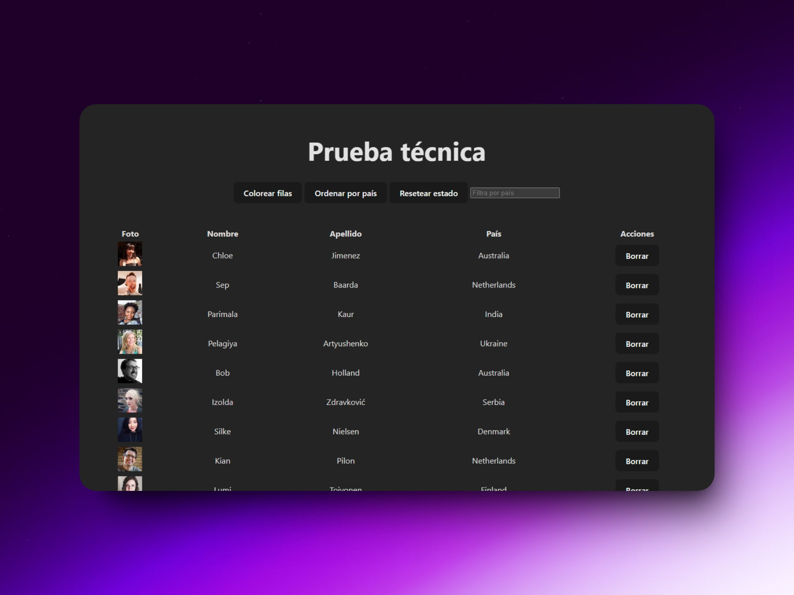
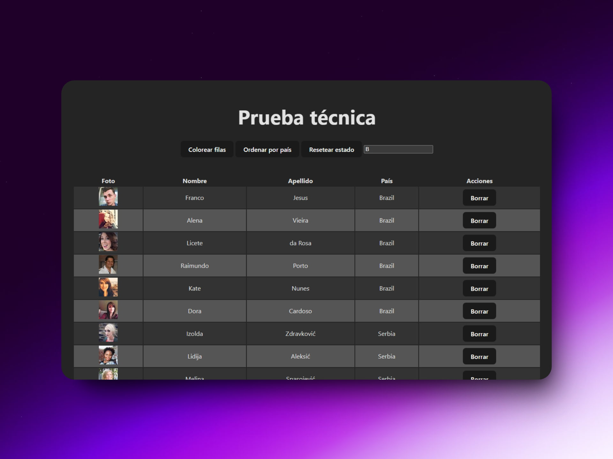

# Prueba técnica con TypeScript y React

Esto es una prueba técnica de una empresa europea para un sueldo de 55000 €/anuales.

El objetivo de esta prueba técnica es crear una aplicación similar a la que se proporciona en este enlace: https://midu-react-11.surge.sh/. Para lograr esto, debe usar la API proporcionada por https://randomuser.me/.

Los pasos a seguir:

- [x] Fetch 100 rows of data using the API.
- [x] Display the data in a table format, similar to the example.
- [x] Provide the option to color rows as shown in the example.
- [x] Allow the data to be sorted by country as demonstrated in the example.
- [x] Enable the ability to delete a row as shown in the example.
- [x] Implement a feature that allows the user to restore the initial state, meaning that all deleted rows will be recovered.
- [x] Handle any potential errors that may occur.
- [x] Implement a feature that allows the user to filter the data by country.
- [x] Avoid sorting users again the data when the user is changing filter by country.
- [x] Sort by clicking on the column header.

### Prueba técnica de React y TypeScript

> 🧩 Aquí puedes ver su [**Live Demo**](https://prueba-tecnica-ts-abrahamgalue.netlify.app/).

## 🚀 Descripción

Esta es una prueba técnica que resolví utilizando React y TypeScript.

## 🎭 Tecnologías

- [**Vite**](https://vitejs.dev/)
- [**React**](https://react.dev/)
- [**TypeScript**](https://www.typescriptlang.org/)
