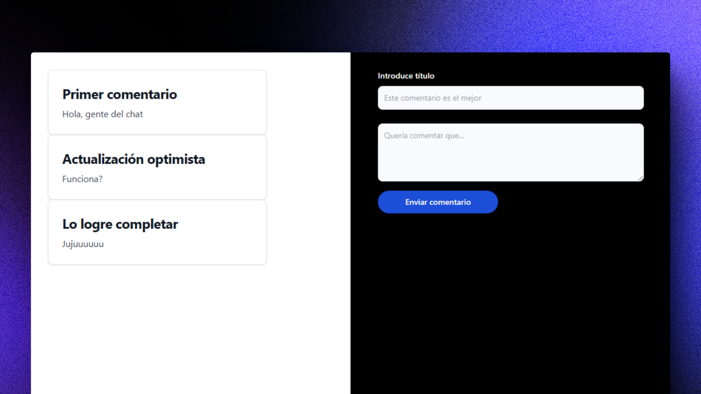

# 📮 React + React Query: Sistema de Comentarios

### Sistema de comentarios hecho con React Query

> 🧩 Aquí puedes ver su [**Live Demo**](https://comments-react-query-abrahamgalue.netlify.app/).

## 🚀 Descripción

Este proyecto es un sistema de comentarios hecho con React Query.

Realiza actualizaciones optimistas de la UI cuando el usuario envia un comentario y se conecta a una base de datos JSON en la nube que proporciona una API REST.

## 🎭 Tecnologías

- [**React/TanStack Query**](https://tanstack.com/query/latest) para **manejar el estado asíncrono** de la aplicación.
- [**JSONBIN**](https://jsonbin.io/) la **API REST** que se encuentra en la nube.
- [**Tailwind CSS**](https://tailwindcss.com/) para la apariencia de la UI.
