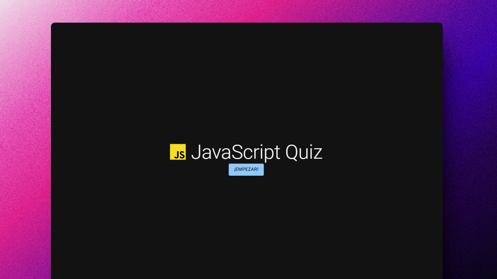
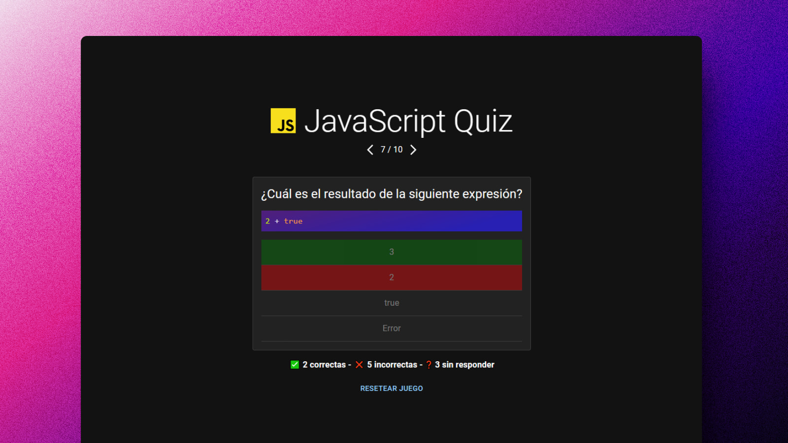

# ❓ React + Zustand: Quiz de JavaScript

### Preguntas para responder acerca de JS

> 🧩 Aquí puedes ver su [**Live Demo**](https://js-quiz-abrahamgalue.netlify.app/).

## 🚀 Descripción

Este proyecto contiene 10 preguntas aleatorias acerca de JS.

Esta basado en el proyecto con el mismo nombre [JavaScript Quiz.](https://javascriptquiz.com/)

Utiliza **Zustand** para manejar el **estado** de la aplicación.

## 🎭 Tecnologías

- [**Zustand**](https://zustand-demo.pmnd.rs/) para **manejar el estado** de la aplicación.
- [**Material UI**](https://mui.com/) para la apariencia de la UI.
